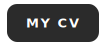

<h1 align="center">👋 Hi, I'm Olga Gulyakevich</h1>
<h3 align="center">Frontend Developer &nbsp;·&nbsp; React · Next.js · TypeScript · GSAP</h3>

<i>Transforming designs into accessible, performant web experiences — with thoughtful animations and attention to every step of the user journey.</i>

  

  &nbsp;

  &nbsp;&nbsp;&nbsp;

  📍 Gland, Vaud, Switzerland 🇨🇭 &nbsp;&nbsp;·&nbsp;&nbsp; English · French · Russian

---

## Tech Stack & Proficiency

  

> **Proficiency levels:** **Production** (built real projects) · **Working** (used, solid understanding) · **Learning** (actively studying) · **Familiar** (hands-on exposure)

### **Modern Frontend**
- **Production:** React (Hooks, Context), React Router, Next.js (App Router, SSR/SSG), Astro (Islands), TypeScript / JavaScript (ES6+), HTML5/CSS3 (Grid, Flexbox)
- **Architecture:** SPA (React) · SSR/SSG (Next.js) · MPA & Static Sites (Astro, Vanilla)
- **Working:** Zustand, Context API, Zod, Vite, Webpack
- **Learning:** React Query, Feature-Sliced Design (FSD), Redux Toolkit

### **Styling & Design**
- **Core Styling:** Sass/SCSS, BEM, Tailwind CSS, Styled Components, Responsive / mobile-first design
- **Advanced CSS:** SVG masks & custom shapes, Defensive CSS patterns, View Transition API
- **Motion UI:** GPU-accelerated animations (transform/opacity only), Scroll-driven & entrance animations, GSAP (ScrollTrigger, timelines)
- **UX Details:** Micro-interactions & tactile UI feedback, `prefers-reduced-motion` — always
- **Design Implementation:** Figma-to-code, Design system development, Motion design (user journey analysis), WCAG AA accessibility

### **CMS & Integrations**
- **Production:** CMS-ready markup (semantic HTML, content-editable zones)
- **Working:** REST API integration
- **Learning:** Headless CMS (Sanity, Payload)
- **Familiar:** Progressive enhancement, PHP & jQuery (legacy)

### **Quality & Deployment**
- **Testing:** Vitest/Jest, React Testing Library, BackstopJS, a11y audits, Multi-stage linting
- **Performance:** Lighthouse 95+, Core Web Vitals, Critical CSS, WebP pipelines, Bundle optimization
- **Deployment:** GitHub Pages/Actions, Netlify, Vercel, npm publishing, Git workflows

---

## Featured Projects

| Project | Stack | Demo | Highlights |
|---------|-------|------|------------|
| [**Memory Game**](https://github.com/OlgaGulyakevich/memory-game) | React · React Router · Webpack · i18next | [Play&nbsp;→](https://olgagulyakevich.github.io/memory-game/) | i18n EN/FR/RU · 3D card animations · WCAG AA · custom Webpack |
| [**Internship Landing**](https://github.com/OlgaGulyakevich/internship-landing-responsive-ui) | Vite · Vanilla JS · SCSS · Swiper.js | [View&nbsp;→](https://olgagulyakevich.github.io/internship-landing-responsive-ui/) | 4 Swiper configs · SVG mask shapes · sliding window pagination · dynamic tabs |
| [**optikit**](https://github.com/OlgaGulyakevich/optikit) | TypeScript · Node · Zod · Vitest | [npm&nbsp;→](https://www.npmjs.com/package/@gulyakevich/optikit) | CLI to optimize web assets (images, video, SVG, favicons, transparency trim) · 4 engines behind one type-safe `Tool<Job>` contract · Strategy (extensible) · Zod-validated boundaries · tested core |

<b>Additional Projects & Work in Progress</b>

### Personal Portfolio v2.0
*Next.js • TypeScript • Tailwind CSS • Payload*

Will include a **Lab / Experiments** section — a curated gallery of interactive animation & micro-interaction demos (motion craft showcase).

**Status:** 🟡 In Development (Launch: Q3 2026)

---

### Upcoming Projects

**Creative Agency Landing**
*Vite • Vanilla JS • GSAP • SCSS*
Animated landing page for a creative agency — scroll-driven animations, motion design, immersive UI. Private repository.

**Spreent Academy — Competitive Frontend Project**
*Vite • Vanilla JS • Sass (SCSS) • BEM — Astro migration in progress*
Pixel-perfect competitive build: Fluid Layout via clamp() with custom `fluid-val()` mixin, magnetic CTA, paint-fill logo reveal, lerp parallax, CSS-only geometry (mask-image avatars, glass mockup), content-visibility: auto, full a11y.

**UGC Creator Portfolio**
*Next.js • TypeScript • Tailwind • Sanity*
Freelance project — portfolio and landing page for a content creator client, with editable content via Sanity (headless CMS).

**Print & Photo Store**
*Next.js • TypeScript • Supabase • Stripe*
E-commerce project — online store for framed prints and photography. Full-stack build: Supabase auth & database, custom admin dashboard (product CRUD, orders), cart, checkout & Stripe payments.

**Mysterious Vacation — Advanced Animation Project**
*Vanilla JS • CSS • SVG • Canvas • Three.js*
Fullscreen scroll-controlled experience with locked transitions, 13 choreographed sequences: spring-physics list reveals, stagger chains, wheel-roll pagination, SVG path drawing & SMIL illustrations, Canvas low-level drawing, Three.js 3D scene with camera rig, cursor-reactive viewport, Post-Processing effects.

---

## What I Bring to Your Team

### Core Strengths
- **Strong React Skills** — Hooks, performance optimization, best practices
- **Design Implementation** — Figma-to-pixel-perfect responsive code
- **Quality-First Mindset** — Accessibility, performance, comprehensive testing
- **Animation & Motion Design** — Thoughtful UI animations, micro-interactions, user journey focus
- **Fast Learner** — Constantly upskilling with latest technologies

### Development Philosophy
> *"Great interfaces are not just built — they're felt"*

- **User-Centered:** Every decision prioritizes user experience
- **Performance-First:** Beautiful designs optimized for speed
- **Accessibility:** WCAG compliance from day one
- **Clean Code:** Maintainable, well-documented solutions, SOLID principles, DRY & KISS
- **Adaptable:** Comfortable with modern React, static sites, or legacy codebases

---

## Learning Journey & Experience

### Experience
- **Web Studio Internship** *(In Progress · Oct 2025 – present)* — production client projects:
  - **Loyalty program promo site** — GSAP animation sequences, View Transitions API, winners table with filters, search & tooltips; prize carousel (Swiper)
  - **Travel companion platform** — built project scaffolding (Vite, Handlebars partials, SCSS architecture) enabling seamless parallel development for the team; implemented complex UI logic: multi-criteria filters, country sorting, robust pagination, and responsive data cards
  - **Online course aggregator** — mega menu, tabs, Fluid Layout 320–1920px, Swiper.js
  - **Cross-cutting contributions:** UX audit (proposed replacing tab-based navigation with radio buttons in the checkout flow to reduce friction and improve conversion; simplified user journey to 3 steps: read → select → continue); accessibility audit — WCAG AA fixes: keyboard navigation, focus management, ARIA labels; cross-browser & cross-device QA; responsive redesign for updated breakpoints

### Education & Training
- **MSc in Information and Computer Science** — Saint Petersburg State University of Aerospace Instrumentation (SUAI), 2009
- **HTML Academy** *(Completed)* — Adaptive Layout, Web Interfaces, Automation & Tooling, JavaScript, React
- **Codecademy Front-End Engineer Path** *(Completed)* — React, Redux, Testing, Deployment
- **Whimsical Animations** *(In Progress)* — Josh W. Comeau — motion design, spring physics, delightful UI
- **Animations on the Web** *(Upcoming)* — Emil Kowalski (animations.dev) — animation principles, Motion (Framer Motion), interruptible animations, performance & taste-driven product motion

**Current Focus (2026):**
- Advanced React architecture & design patterns
- Protocols & networking (HTTP/HTTPS, WebSocket fundamentals)
- Web security (OWASP Top 10, CSP, auth flows)
- UI Engineering — Canvas, WebGL, Three.js

**Goal:** Frontend developer role in Switzerland / EU · available from October 2026

---

## Ideal Opportunities

- Frontend roles with strong **design implementation & motion design** focus — custom interfaces, scroll-driven animations, micro-interactions
- Studios / agencies building bespoke, design-led sites (pixel-perfect, custom layouts)
- Product teams where UI quality, accessibility & performance matter
- Teams with mentorship and growth potential

---

## Get in Touch

  &nbsp;&nbsp;&nbsp;&nbsp;&nbsp;&nbsp;

<i>Let's build something thoughtful, accessible and delightful together.</i>

  

  

