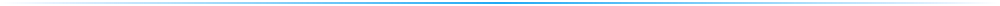
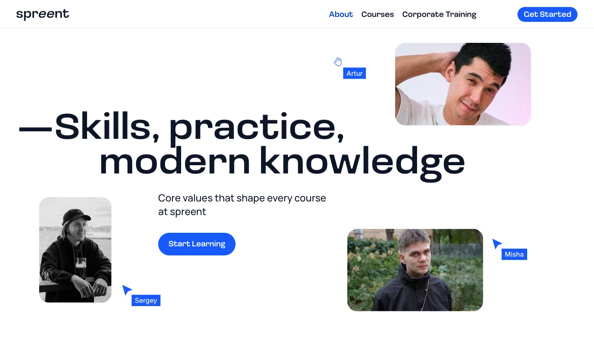

<h1 align="center">Olga Gulyakevich</h1>

<h3 align="center">Frontend Developer &nbsp;·&nbsp; React · Next.js · TypeScript · Motion &amp; Accessibility</h3>

Hi 👋 I'm Olga — a frontend developer who cares as much about how an interface *feels* as about how it's built.

I turn Figma files into fast, accessible interfaces in React, TypeScript and Astro — and when there's no Figma file, I design the thing myself. My focus is **motion with a job**: knowing where an animation helps, where it gets in the way, and where there shouldn't be any at all.

Every project I ship comes with a documented UI kit page, and every motion effect is reduced-motion safe.

  

  &nbsp;&nbsp;&nbsp;

  📍 Gland, Vaud, Switzerland 🇨🇭 &nbsp;·&nbsp; English · French · Russian &nbsp;·&nbsp; open to frontend roles

## Featured Projects

  

### Spreent Academy — design-led landing page

*Astro · TypeScript (strict) · SCSS/BEM · Vitest · Playwright*

**PageSpeed 100 · 100 · 100 · 100** with 18 motion effects running — every one guarded by `prefers-reduced-motion`. Ships with a public **[/ui-kit page](https://spreent-academy-frontend.vercel.app/ui-kit)** documenting the component set and each effect, including a shimmer that fires **only when the user hesitates** (IntersectionObserver + dwell detection + cancel-on-engage). Playwright in CI for e2e and visual regression.

**[Live →](https://spreent-academy-frontend.vercel.app)** &nbsp;·&nbsp; [Code →](https://github.com/OlgaGulyakevich/spreent-academy-frontend)

---

### optikit — TypeScript CLI, published on npm

*TypeScript (strict) · Node · Zod · Vitest*

Optimises web assets — images (WebP/AVIF), video, SVG, favicons, transparency trim — behind one type-safe `Tool<Job>` contract. Strategy pattern for extensibility, Zod-validated boundaries, tested core. I use it on my own projects.

**[npm →](https://www.npmjs.com/package/@gulyakevich/optikit)** &nbsp;·&nbsp; [Code →](https://github.com/OlgaGulyakevich/optikit)

---

### Memory Game — React application

*React · React Router · Webpack · i18next*

**PageSpeed 100 · 100 · 100 · 100** · trilingual EN/FR/RU · 3D card flip on `rotateY` + `preserve-3d`, GPU only · WCAG AA with `prefers-reduced-motion` · 115 KB gzipped with hand-split Webpack chunks.

**[Play →](https://olgagulyakevich.github.io/memory-game/)** &nbsp;·&nbsp; [Code →](https://github.com/OlgaGulyakevich/memory-game)

<b>More projects &amp; work in progress</b>

 

### Internship Landing

*Vite · Vanilla JS · SCSS · Swiper.js*

Pixel-perfect educational program landing — 4 Swiper configs, SVG mask shapes, sliding-window pagination, dynamic tabs.

[Live →](https://olgagulyakevich.github.io/internship-landing-responsive-ui/) &nbsp;·&nbsp; [Code →](https://github.com/OlgaGulyakevich/internship-landing-responsive-ui)

---

### UGC Creator Portfolio &nbsp; 🟡 in progress

*Astro · React 19 · TypeScript (strict) · Tailwind CSS 4*

Freelance client project, built end to end: the client brought a business goal, everything else was mine — interface design, motion plan, implementation and deployment. Ships with its own `/ui-kit` page.

### Personal Portfolio &nbsp; 🟡 in progress

*Next.js · TypeScript · Tailwind CSS*

Will include a **Lab** section — a curated gallery of interaction and micro-animation demos, each with a note on when to use it and when not to.

### Creative Agency Landing

*Vite · Vanilla JS · GSAP · SCSS* — scroll-driven animation, immersive UI. Private repository.

## Get in Touch

  &nbsp;&nbsp;&nbsp;&nbsp;&nbsp;&nbsp;

  Let's chat — <a href="mailto:olga.gulyakevi4@gmail.com">olga.gulyakevi4@gmail.com</a>

